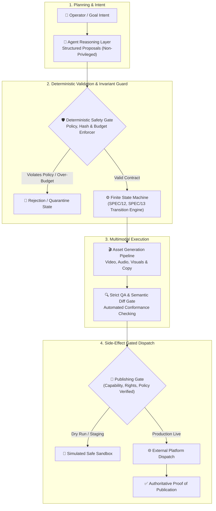

# ⚡ AMCCA · Autonomous Multimodal Content Creation & Monetization Center

[-0071e3.svg)]()
[]()
[]()
[]()
[]()

> **AMCCA (Autonomous Multimodal Content Creation & Monetization Center)** is an implementation-grade, deterministic software system and engineering specification for end-to-end autonomous content synthesis, multimodal rendering, quality verification, and monetization.
> 
> **Core Architecture:** Deterministic code strictly governs state, capital budgets, access credentials, transactional storage, and external side effects. AI agents propose structured outputs within mathematical bounds; they **never mutate protected state** and **never decide whether a safety gate passed**.

---

## 🏛️ System Topology & Execution Flow



---

## 💎 The 10 Non-Negotiable Principles

1. **Deterministic State Authority:** Deterministic code controls state, money, permissions, files, cryptographic hashes, budgets, credentials, retries, and external side effects.
2. **AI Boundary Isolation:** AI agents reason and propose structured outputs. They do *not* mutate protected state and do *not* decide whether a gate passed.
3. **No Silent State Coercion:** Unknown external state is never silently converted to success or failure.
4. **Guarded Side Effects:** Publishing is a side effect behind explicit capability, policy, credential, rights, disclosure, and QA gates.
5. **Traceability & Reproducibility:** Every important decision and artifact is traceable, versioned, and cryptographically reproducible.
6. **Bounded Autonomy:** Autonomous mode is bounded by explicit policy, never by agent discretion.
7. **Resilient Recovery:** The application recovers safely after restarts, crashes, timeouts, network loss, and ambiguous external responses.
8. **No Fake Integrations:** No integration is simulated. An unsupported or unverified capability is disabled, never faked.
9. **Strict Value Typing:** Estimates and empirical measurements are different types and never overwrite one another.
10. **Executable Release Gates:** A release gate is an executable check, never a prose claim.

---

## 📖 Source of Truth Hierarchy

When resolving any design conflict, implementation **must halt immediately** until the contradiction is resolved in `DECISIONS.md`. Never choose silently:

| Priority | Level | Authority / Scope |
|:---:|---|---|
| **1** | **`DECISIONS.md`** | Invariant architectural decisions and boundary definitions. |
| **2** | **`BLUEPRINT/10_OPERATIONAL_INVARIANTS.md`** | Non-negotiable system rules that must always hold true. |
| **3** | **`BLUEPRINT/` Documents** | Master architecture, boundaries, and system responsibilities. |
| **4** | **`SPEC/` Specifications** | Normative technical specifications (`SPEC/01` to `SPEC/83`). |
| **5** | **`SCHEMAS/` (JSON Schemas)** | Machine-readable schemas (Draft 2020-12) & `state-machine.json`. |
| **6** | **`POLICIES/`** | Operational policies, budgets, rates, and approval rules. |
| **7** | **`CONFIG/`** | Example environments and runtime configuration prose. |

> [!IMPORTANT]
> Generated files (`SPEC/11`, `SPEC/13`, `SCHEMAS/*.json`, `MANIFEST.md`) are outputs, not inputs: edit the generator script, never the artifact directly (Decision D-025).

---

## 🧭 Canonical Entry Points

| Task / Question | Reference Document |
|---|---|
| What may I **not** change? | [`DECISIONS.md`](DECISIONS.md) |
| What must **always** hold true? | [`BLUEPRINT/10_OPERATIONAL_INVARIANTS.md`](BLUEPRINT/10_OPERATIONAL_INVARIANTS.md) |
| What is the high-level shape of the system? | [`BLUEPRINT/00_MASTER_BLUEPRINT.md`](BLUEPRINT/00_MASTER_BLUEPRINT.md) |
| What valid states can a production be in? | [`SPEC/12`](SPEC/12_PRODUCTION_LIFECYCLE_STATE_MACHINE.md), [`SPEC/13`](SPEC/13_PRODUCTION_STATE_MACHINE_FORMAL_DEFINITION.md) |
| What does the database schema enforce? | [`SPEC/10`](SPEC/10_RELATIONAL_DATABASE_STORAGE_ENGINE.md), [`SPEC/11`](SPEC/11_DATABASE_SCHEMA_DEFINITION.md) |
| What is the contract for a given aggregate? | Files located in [`SCHEMAS/`](SCHEMAS/) |
| What defines release-readiness? | [`SPEC/79_DEFINITION_OF_DONE.md`](SPEC/79_DEFINITION_OF_DONE.md) |
| In what exact sequence is the system built? | [`BUILD_ORDER.md`](BUILD_ORDER.md), [`SPEC/80`](SPEC/80_PHASED_IMPLEMENTATION_AND_INTEGRATION_PLAN.md) |
| Where do autonomous agents start? | [`ANTIGRAVITY_START_PROMPT.md`](ANTIGRAVITY_START_PROMPT.md) |

---

## 🎛️ Modes & Environments (Two Orthogonal Axes)

The system isolates **where** it runs from **how** it behaves:

### Axis 1: Environment
- **`DEVELOPMENT`:** Local sandbox with synthetic and mock external providers.
- **`STAGING`:** Pre-production verification with real non-production platform credentials.
- **`PRODUCTION`:** Live commercial operation.

### Axis 2: Operational Flags
- **`publishing_enabled`** *(bool)*: Controls whether publication intents may be dispatched to external platforms.
- **`dry_run`** *(bool)*: When active, every tool of class `EXTERNAL_UNSAFE` is blocked; planning, generation, and QA run fully.
- **`autonomy_mode`**: `MANUAL`, `ASSISTED`, or `AUTONOMOUS` (governs human approval thresholds).

---

## 🧪 Mechanical Self-Validation & Release Gate

The package validates itself mechanically. A failing validator is a failing build:

```bash
# 1. Install pinned tooling dependencies
pip install -r TOOLS/requirements.txt

# 2. Execute the single canonical release gate
python TOOLS/release_gate.py
```

### Granular Diagnostic Tools
Individual validation suites can be executed independently:

```bash
python TOOLS/validate_package.py                   # Structural, contract & drift check
python TOOLS/validate_package.py --regen           # Regenerate derived artifacts and verify
python TOOLS/generate_artifacts.py --check         # Byte-for-byte generator drift check (V31-01)
python TOOLS/conformance_tests.py                  # Schema coverage with positive/negative cases
python TOOLS/test_version_consistency.py           # Enforce unified version across normative files
python TOOLS/test_generated_artifacts_semantics.py  # Semantic validation beyond byte diffs
python TOOLS/test_database_contract_source.py       # DDL tests load actual generated DDL
python TOOLS/test_no_contract_duplication.py        # Prohibits hard-coded duplicate DDL
python TOOLS/test_mutations.py                      # Mutation tests: proves invariants fail when broken
```

### Mechanical Proof Guarantees
- **State Space:** Every state has an inbound transition; every non-terminal state has an outbound transition; terminal states cannot transition out; all states are reachable from `INIT`.
- **Contract Strictness:** Every JSON schema complies with Draft 2020-12 and carries `schema_version`. `format: date-time` is enforced by active format checkers.
- **Financial Rigor:** Monetary fields are strictly non-negative (except designated ledger offsets), and zero tooling code uses floating-point arithmetic for currency.
- **Publication Proof:** No publication reaches `VERIFIED` without cryptographic or authoritative API evidence.

---

## 📁 Repository Structure

```text
AMCCA-Engineering-V3.1/
├── BLUEPRINT/                 # Architectural blueprints and operational invariants
├── SPEC/                      # Normative specifications (01 to 83)
├── SCHEMAS/                   # JSON Schemas (2020-12) and state-machine.json
├── POLICIES/                  # Governance, budgets, and capability gates
├── CONFIG/                    # Environment configurations
├── src/                       # Production source code (.NET Core / C# + Python)
├── tests/                     # Integration and verification test suites
├── TOOLS/                     # Mechanical validation and release-gate scripts
├── AUDIT/                     # Historical audit trails and defect resolution logs
├── artifacts/                 # Generated build outputs (AMCCA.exe, installer)
├── DECISIONS.md               # Supreme source of truth for architectural decisions
├── BUILD_ORDER.md             # Sequential phase implementation order
├── MANIFEST.md                # Cryptographic manifest of all repository files
└── README.md                  # Implementation-grade engineering overview
```

---

## 📄 License & Intellectual Property

Proprietary and Confidential Engineering Specification. All rights reserved.  
Refer to [POLICIES/](POLICIES/) and [DECISIONS.md](DECISIONS.md) for usage and distribution terms.
